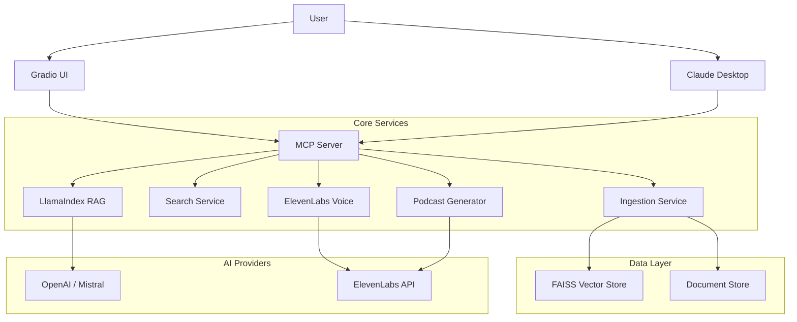

# 📚 AI Digital Library Assistant
### *Your Intelligent Knowledge Companion with Voice & Podcast Capabilities*

> **"Transform your static documents into an interactive, voice-enabled knowledge base that talks back to you."**

[](https://opensource.org/licenses/MIT)
[](https://www.python.org/downloads/)
[](https://www.llamaindex.ai/)
[](https://elevenlabs.io/)
[](https://modelcontextprotocol.io/)

**[🔴 LIVE DEMO: Try it on HuggingFace Spaces](https://huggingface.co/spaces/Nihal2000/AI-Digital-Library-Assistant-MCP-Agent)**

---

## 🌟 What Makes This Special?

The **AI Digital Library Assistant** is not just another document search tool. It's a comprehensive **Model Context Protocol (MCP)** server that revolutionizes how you interact with information.

### 🚀 Killer Features
1.  **🎧 World's First Document-to-Podcast Generator**: Turn boring reports into engaging, multi-voice conversational podcasts using **LlamaIndex** analysis and **ElevenLabs** synthesis.
2.  **🎙️ Voice-Enabled Librarian**: Talk naturally to your library. The agent understands context, searches documents, and responds with a human-like voice.
3.  **🤖 Agentic RAG Workflows**: Powered by **LlamaIndex ReAct Agents**, it doesn't just search—it reasons, plans, and executes complex multi-step research tasks.
4.  **🔌 Production-Ready MCP Server**: Seamlessly integrate with **Claude Desktop** or any MCP client to give your LLM direct access to your private knowledge base.

---

## ⚡ Quick Start

### 1. Clone the Repository
```bash
git clone https://github.com/nihald2000/AI-Digital-Library-Assistant.git
cd AI-Digital-Library-Assistant
```

### 2. Install Dependencies
```bash
pip install -r requirements.txt
```

### 3. Set API Keys
Create a `.env` file:
```env
OPENAI_API_KEY=sk-...
ELEVENLABS_API_KEY=xi-...
ELEVENLABS_AGENT_ID=... (optional for voice agent)
```

### 4. Run the Assistant
```bash
python app.py
```
*Access the UI at http://localhost:7860*

---

## 🏗️ System Architecture

The system is built on a modular microservices architecture exposed via the Model Context Protocol.



---

## 🛠️ MCP Tools Documentation

The server exposes **8 powerful tools** to any MCP-compatible client (like Claude Desktop).

### 1. `ingest_document`
Upload and process documents (PDF, TXT, DOCX, Images).
- **Args**: `file_path` (str), `file_type` (str)
- **Returns**: Document ID and chunk stats.

### 2. `semantic_search`
Find relevant content using vector similarity.
- **Args**: `query` (str), `top_k` (int)
- **Returns**: Ranked list of matching segments.

### 3. `answer_question` (RAG)
Ask questions about your documents.
- **Args**: `question` (str), `context_filter` (dict)
- **Returns**: AI-generated answer with citations.

### 4. `voice_qa` 🎙️
Voice-optimized Q&A for conversational interfaces.
- **Args**: `message` (str), `session_id` (str)
- **Returns**: Speech-ready text response.

### 5. `generate_podcast` 🎧
Create an audio podcast from selected documents.
- **Args**: `document_ids` (list), `style` (str), `duration_minutes` (int)
- **Returns**: Path to generated MP3 file.

### 6. `summarize_content`
Generate summaries in various styles.
- **Args**: `document_id` (str), `style` (str)
- **Returns**: Summary text.

### 7. `generate_tags`
Auto-tag documents for organization.
- **Args**: `document_id` (str), `max_tags` (int)
- **Returns**: List of tags.

### 8. `list_documents_for_ui`
Retrieve library metadata.
- **Returns**: List of available documents.

---

## 🎥 Demo Video Script

> **Watch the full demo here: [YouTube Link Placeholder]**

| Time | Section | Description |
|------|---------|-------------|
| **0:00** | **Intro** | "Meet your new AI Digital Library Assistant—it reads, listens, and even makes podcasts." |
| **0:30** | **Ingestion** | Drag-and-drop a complex PDF research paper. Watch it get indexed in seconds. |
| **1:00** | **Agentic RAG** | Ask: "Compare the methodologies in these 3 papers." Watch the agent plan and execute. |
| **2:00** | **Podcast** | **THE WOW FACTOR**: Select a paper, choose "Conversational" style, and generate a 5-min podcast. Play the audio. |
| **3:30** | **MCP** | Switch to Claude Desktop. Ask Claude to "Read my library and summarize the latest findings." |
| **4:00** | **Outro** | "Built with LlamaIndex, ElevenLabs, and MCP. The future of knowledge management." |

---

## 💻 Technology Stack

We chose the best-in-class tools to build this agent:

| Component | Technology | Why We Chose It |
|-----------|------------|-----------------|
| **Orchestration** | **LlamaIndex** | Best-in-class agentic RAG and data connectors. Essential for complex reasoning. |
| **Voice AI** | **ElevenLabs** | Unmatched voice quality and low latency. Critical for the podcast feature. |
| **Protocol** | **MCP (FastMCP)** | The standard for connecting AI models to data. Enables Claude Desktop integration. |
| **LLM** | **OpenAI / Mistral** | Reliable reasoning and high-context windows for document analysis. |
| **UI** | **Gradio** | Rapid prototyping of beautiful, functional web interfaces. |
| **Vector DB** | **FAISS** | Fast, local, and efficient similarity search. |

---

## 🤝 Sponsor Recognition

A huge thank you to our hackathon sponsors for enabling this innovation:

- **LlamaIndex**: The `ReActAgent` and `VectorStoreIndex` form the brain of our system, allowing it to "think" about documents rather than just search them.
- **ElevenLabs**: The `Text-to-Speech` API brings our library to life, powering both the Voice Assistant and the unique Podcast Generator.
- **Model Context Protocol**: Provided the standardized framework to expose our tools to the world, making this a true "Agentic" platform.

---

## 🚀 Deployment

### Option 1: Local (Recommended for Dev)
```bash
python app.py
```

### Option 2: Claude Desktop Integration
Add this to your `claude_desktop_config.json`:
```json
{
  "mcpServers": {
    "digital-library": {
      "command": "python",
      "args": ["/absolute/path/to/mcp_server.py"]
    }
  }
}
```

### Option 3: Blaxel Cloud
```bash
./deploy.sh
```

---

## 📜 License

This project is licensed under the MIT License - see the [LICENSE](LICENSE) file for details.

---

<div align="center">
  <sub>Built with ❤️ for the MCP Hackathon 2024</sub>
</div>
