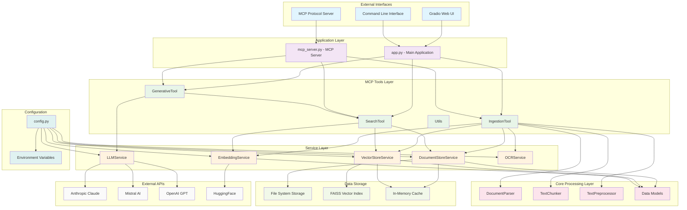
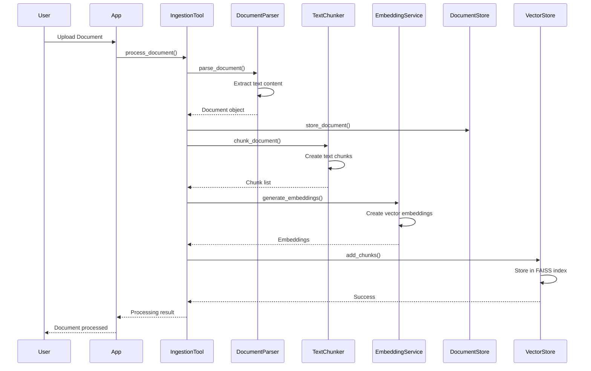
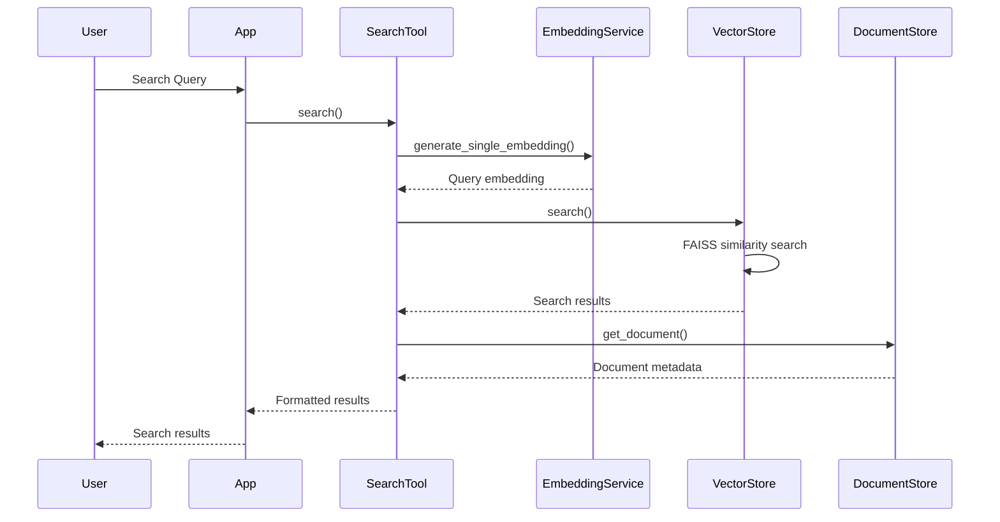
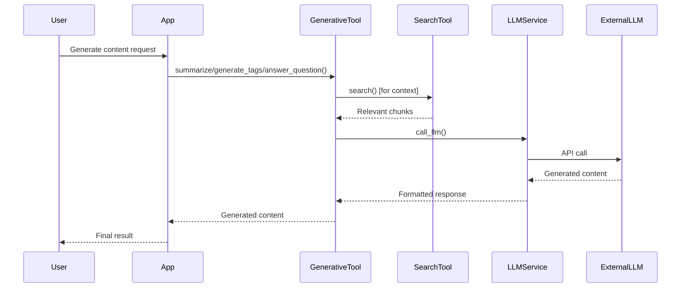

# Intelligent Content Organizer MCP Agent - Complete Codebase Architecture Graph

## 🏗️ System Architecture Overview



## 📊 Detailed Component Relationships

### 1. **Document Processing Pipeline**



### 2. **Search and Retrieval Flow**



### 3. **Generative AI Flow**



## 🗂️ File Structure and Dependencies

### **Root Level Files**
```
intelligent-content-organizer-MCP-Agent/
├── app.py                    # Main Gradio web application
├── mcp_server.py            # MCP protocol server
├── config.py                # Configuration management
├── requirements.txt         # Python dependencies
└── README.md               # Project documentation
```

### **Core Modules**
```
core/
├── models.py               # Data models (Document, Chunk, SearchResult)
├── document_parser.py      # Document parsing and extraction
├── chunker.py             # Text chunking strategies
├── text_preprocessor.py   # Text cleaning and preprocessing
└── __init__.py
```

### **Service Layer**
```
services/
├── document_store_service.py  # Document storage and retrieval
├── vector_store_service.py    # FAISS vector database
├── embedding_service.py       # Text embedding generation
├── llm_service.py            # LLM API integration
├── ocr_service.py            # OCR for image processing
└── __init__.py
```

### **MCP Tools**
```
mcp_tools/
├── ingestion_tool.py         # Document ingestion pipeline
├── search_tool.py           # Semantic search functionality
├── generative_tool.py       # AI content generation
├── utils.py                 # Utility functions
└── __init__.py
```

### **Data Storage**
```
data/
├── documents/
│   ├── content/             # Document text content
│   └── metadata/            # Document metadata
└── vector_store/
    ├── content_index.index  # FAISS vector index
    └── content_index_metadata.json
```

## 🔄 Data Flow Architecture

### **Document Ingestion Flow**
```
File Upload → Document Parser → Text Extraction → 
Text Preprocessing → Chunking → Embedding Generation → 
Document Storage → Vector Storage → Index Update
```

### **Search Flow**
```
Query → Text Preprocessing → Embedding Generation → 
Vector Search → Result Ranking → Document Retrieval → 
Result Formatting → Response
```

### **Generation Flow**
```
Request → Context Retrieval → Prompt Construction → 
LLM API Call → Response Processing → Content Generation → 
Result Formatting → Response
```

## 🎯 Key Design Patterns

### **1. Service Layer Pattern**
- **Purpose**: Encapsulate business logic and external dependencies
- **Components**: DocumentStoreService, VectorStoreService, EmbeddingService, etc.
- **Benefits**: Separation of concerns, testability, reusability

### **2. Tool Layer Pattern**
- **Purpose**: Expose functionality through MCP protocol
- **Components**: IngestionTool, SearchTool, GenerativeTool
- **Benefits**: Protocol abstraction, tool composition

### **3. Async/Await Pattern**
- **Purpose**: Non-blocking I/O operations
- **Usage**: Throughout the codebase for API calls and file operations
- **Benefits**: Scalability, responsiveness

### **4. Repository Pattern**
- **Purpose**: Abstract data access layer
- **Components**: DocumentStoreService, VectorStoreService
- **Benefits**: Data access abstraction, testability

### **5. Factory Pattern**
- **Purpose**: Create objects based on configuration
- **Usage**: LLM service selection, embedding model loading
- **Benefits**: Flexibility, configuration-driven behavior

## 🔧 Configuration Management

### **Environment Variables**
```python
# API Keys
ANTHROPIC_API_KEY
MISTRAL_API_KEY
HUGGINGFACE_API_KEY
OPENAI_API_KEY

# Model Configuration
EMBEDDING_MODEL
ANTHROPIC_MODEL
MISTRAL_MODEL
OPENAI_MODEL

# Storage Configuration
VECTOR_STORE_PATH
DOCUMENT_STORE_PATH
INDEX_NAME

# Processing Configuration
CHUNK_SIZE
CHUNK_OVERLAP
MAX_CONCURRENT_REQUESTS
```

## 🚀 Deployment Architecture

### **Development Mode**
```
User → Gradio UI → Local Services → Local Storage
```

### **Production Mode**
```
User → MCP Client → MCP Server → Services → Persistent Storage
```

### **Scalability Considerations**
- **Horizontal Scaling**: Multiple MCP server instances
- **Vertical Scaling**: GPU acceleration for embeddings
- **Caching**: In-memory document and embedding cache
- **Persistence**: File-based storage with backup strategies

## 🔍 Error Handling and Resilience

### **Error Handling Strategy**
1. **Graceful Degradation**: Fallback models and services
2. **Retry Logic**: API call retries with exponential backoff
3. **Circuit Breaker**: Prevent cascading failures
4. **Logging**: Comprehensive error logging and monitoring

### **Data Integrity**
1. **Transaction Safety**: Atomic operations for document processing
2. **Backup Strategies**: Regular index and metadata backups
3. **Validation**: Input validation and data sanitization
4. **Recovery**: Automatic recovery from partial failures

This architecture provides a robust, scalable, and maintainable foundation for intelligent content organization with clear separation of concerns and well-defined interfaces between components. 