# Component Dependency Graph - Detailed Analysis

## 🔗 Module Dependencies

```mermaid
graph TD
    %% Root Level Dependencies
    APP[app.py] --> INGEST[IngestionTool]
    APP --> SEARCH[SearchTool]
    APP --> GEN[GenerativeTool]
    APP --> DS[DocumentStoreService]
    APP --> VS[VectorStoreService]
    APP --> ES[EmbeddingService]
    APP --> LS[LLMService]
    APP --> OS[OCRService]
    APP --> MODELS[core.models]
    APP --> CONFIG[config.py]

    MCP_SERVER[mcp_server.py] --> INGEST
    MCP_SERVER --> SEARCH
    MCP_SERVER --> GEN
    MCP_SERVER --> DS
    MCP_SERVER --> VS
    MCP_SERVER --> ES
    MCP_SERVER --> LS
    MCP_SERVER --> OS
    MCP_SERVER --> CONFIG

    %% Tool Layer Dependencies
    INGEST --> DP[DocumentParser]
    INGEST --> TC[TextChunker]
    INGEST --> TP[TextPreprocessor]
    INGEST --> DS
    INGEST --> VS
    INGEST --> ES
    INGEST --> OS
    INGEST --> MODELS

    SEARCH --> VS
    SEARCH --> ES
    SEARCH --> DS
    SEARCH --> MODELS

    GEN --> LS
    GEN --> SEARCH
    GEN --> MODELS

    UTILS[utils.py] --> MODELS
    UTILS --> CONFIG

    %% Service Layer Dependencies
    DS --> MODELS
    DS --> CONFIG

    VS --> MODELS
    VS --> CONFIG

    ES --> CONFIG

    LS --> CONFIG

    OS --> CONFIG

    %% Core Layer Dependencies
    DP --> MODELS
    DP --> OS

    TC --> MODELS

    TP --> MODELS

    %% External Dependencies
    ES --> SENTENCE_TRANSFORMERS[sentence-transformers]
    ES --> TORCH[torch]
    ES --> NUMPY[numpy]

    VS --> FAISS[faiss-cpu]
    VS --> NUMPY

    LS --> ANTHROPIC[anthropic]
    LS --> MISTRAL[mistralai]
    LS --> OPENAI[openai]

    OS --> PYTESSERACT[pytesseract]
    OS --> PIL[Pillow]

    DP --> PYPDF2[PyPDF2]
    DP --> DOCX[python-docx]
    DP --> BEAUTIFULSOUP[beautifulsoup4]

    %% Gradio Dependencies
    APP --> GRADIO[gradio]
    APP --> NEST_ASYNCIO[nest_asyncio]

    %% MCP Dependencies
    MCP_SERVER --> FASTMCP[fastmcp]

    %% Styling
    classDef root fill:#e3f2fd
    classDef tool fill:#e8f5e8
    classDef service fill:#fff3e0
    classDef core fill:#fce4ec
    classDef external fill:#fafafa
    classDef config fill:#e0f2f1

    class APP,MCP_SERVER root
    class INGEST,SEARCH,GEN,UTILS tool
    class DS,VS,ES,LS,OS service
    class DP,TC,TP,MODELS core
    class SENTENCE_TRANSFORMERS,TORCH,NUMPY,FAISS,ANTHROPIC,MISTRAL,OPENAI,PYTESSERACT,PIL,PYPDF2,DOCX,BEAUTIFULSOUP,GRADIO,NEST_ASYNCIO,FASTMCP external
    class CONFIG config
```



## 📋 Detailed Import Analysis

### **app.py Dependencies**
```python
# Core Framework
import gradio as gr
import asyncio
import nest_asyncio

# Custom Modules
from mcp_tools.ingestion_tool import IngestionTool
from mcp_tools.search_tool import SearchTool
from mcp_tools.generative_tool import GenerativeTool
from services.vector_store_service import VectorStoreService
from services.document_store_service import DocumentStoreService
from services.embedding_service import EmbeddingService
from services.llm_service import LLMService
from services.ocr_service import OCRService
from core.models import SearchResult, Document
import config
```

### **mcp_server.py Dependencies**
```python
# Core Framework
import asyncio
from mcp.server.fastmcp import FastMCP

# Services
from services.vector_store_service import VectorStoreService
from services.document_store_service import DocumentStoreService
from services.embedding_service import EmbeddingService
from services.llm_service import LLMService
from services.ocr_service import OCRService

# Tools
from mcp_tools.ingestion_tool import IngestionTool
from mcp_tools.search_tool import SearchTool
from mcp_tools.generative_tool import GenerativeTool
```

### **IngestionTool Dependencies**
```python
# Core Processing
from core.document_parser import DocumentParser
from core.chunker import TextChunker
from core.text_preprocessor import TextPreprocessor

# Services
from services.vector_store_service import VectorStoreService
from services.document_store_service import DocumentStoreService
from services.embedding_service import EmbeddingService
from services.ocr_service import OCRService
```

### **SearchTool Dependencies**
```python
# Services
from services.vector_store_service import VectorStoreService
from services.embedding_service import EmbeddingService
from services.document_store_service import DocumentStoreService

# Models
from core.models import SearchResult
```

### **GenerativeTool Dependencies**
```python
# Services
from services.llm_service import LLMService

# Tools
from mcp_tools.search_tool import SearchTool

# Models
from core.models import SearchResult
```

## 🔄 Circular Dependency Analysis

### **No Circular Dependencies Found**
The codebase follows a clean hierarchical structure:

1. **Configuration Layer** (`config.py`) - No dependencies
2. **Models Layer** (`core/models.py`) - No dependencies
3. **Core Processing Layer** - Depends only on models
4. **Service Layer** - Depends on models and config
5. **Tool Layer** - Depends on services and core
6. **Application Layer** - Depends on tools and services

## 📊 Dependency Complexity Metrics

### **Most Dependent Modules**
1. **app.py** - 9 direct dependencies
2. **mcp_server.py** - 8 direct dependencies
3. **IngestionTool** - 7 direct dependencies
4. **SearchTool** - 4 direct dependencies
5. **GenerativeTool** - 3 direct dependencies

### **Most Used Modules**
1. **core.models** - Used by 8 modules
2. **config.py** - Used by 6 modules
3. **DocumentStoreService** - Used by 4 modules
4. **VectorStoreService** - Used by 4 modules
5. **EmbeddingService** - Used by 3 modules

## 🎯 Dependency Injection Pattern

### **Service Initialization**
```python
# In app.py and mcp_server.py
vector_store = VectorStoreService()
document_store = DocumentStoreService()
embedding_service = EmbeddingService()
llm_service = LLMService()
ocr_service = OCRService()

# Tool initialization with injected services
ingestion_tool = IngestionTool(
    vector_store=vector_store,
    document_store=document_store,
    embedding_service=embedding_service,
    ocr_service=ocr_service
)
```

### **Benefits of This Pattern**
1. **Testability**: Services can be mocked for unit testing
2. **Flexibility**: Different service implementations can be injected
3. **Loose Coupling**: Tools don't create their own service instances
4. **Resource Management**: Centralized service lifecycle management

## 🔧 Configuration Dependencies

### **Service Configuration Dependencies**
```python
# All services depend on config.py
class DocumentStoreService:
    def __init__(self):
        self.config = config.config
        self.store_path = Path(self.config.DOCUMENT_STORE_PATH)

class VectorStoreService:
    def __init__(self):
        self.config = config.config
        self.store_path = Path(self.config.VECTOR_STORE_PATH)

class EmbeddingService:
    def __init__(self):
        self.config = config.config
        self.model_name = self.config.EMBEDDING_MODEL
```

## 🚀 External Library Dependencies

### **AI/ML Libraries**
- **sentence-transformers**: Text embedding generation
- **torch**: PyTorch for deep learning models
- **numpy**: Numerical computing
- **faiss-cpu**: Vector similarity search

### **LLM APIs**
- **anthropic**: Claude API integration
- **mistralai**: Mistral AI API integration
- **openai**: OpenAI API integration

### **Document Processing**
- **PyPDF2**: PDF text extraction
- **python-docx**: Word document processing
- **beautifulsoup4**: HTML parsing
- **pytesseract**: OCR for images
- **Pillow**: Image processing

### **Web Framework**
- **gradio**: Web UI framework
- **fastmcp**: MCP protocol server

### **Utilities**
- **nest_asyncio**: Nested event loop support
- **pathlib**: Path manipulation
- **pydantic**: Data validation

## 📈 Dependency Health Metrics

### **Positive Indicators**
✅ **No Circular Dependencies**: Clean hierarchical structure
✅ **Single Responsibility**: Each module has focused purpose
✅ **Dependency Injection**: Loose coupling between components
✅ **Configuration Centralization**: Single config source
✅ **Clear Separation**: Distinct layers with well-defined boundaries

### **Areas for Optimization**
🔄 **Service Coupling**: Some services are tightly coupled to specific tools
🔄 **External Dependencies**: Heavy reliance on external APIs
🔄 **Configuration Coupling**: All services depend on global config

## 🎯 Recommendations

### **Immediate Improvements**
1. **Interface Abstraction**: Create interfaces for services to reduce coupling
2. **Dependency Container**: Implement a proper DI container
3. **Configuration Validation**: Add runtime config validation
4. **Error Boundary**: Implement error boundaries between layers

### **Long-term Enhancements**
1. **Plugin Architecture**: Make tools pluggable
2. **Service Discovery**: Dynamic service registration
3. **Health Checks**: Service health monitoring
4. **Metrics Collection**: Dependency performance metrics

This dependency analysis shows a well-structured codebase with clear separation of concerns and minimal coupling between components. 