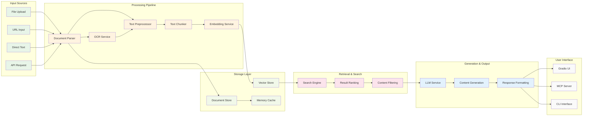
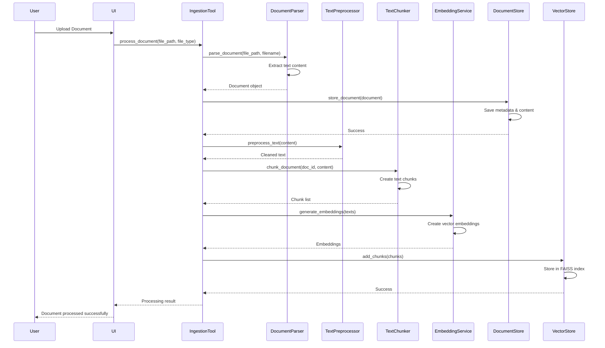
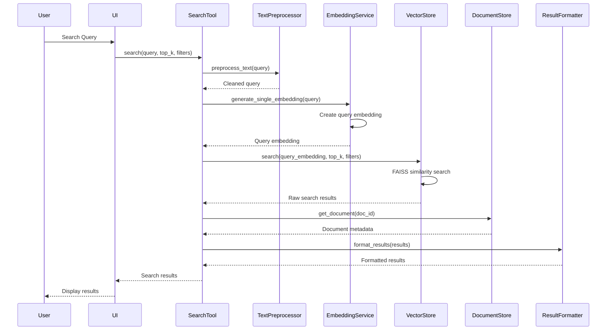
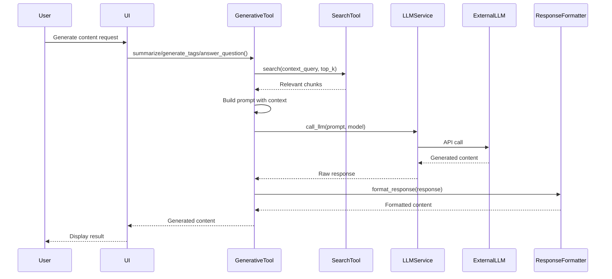
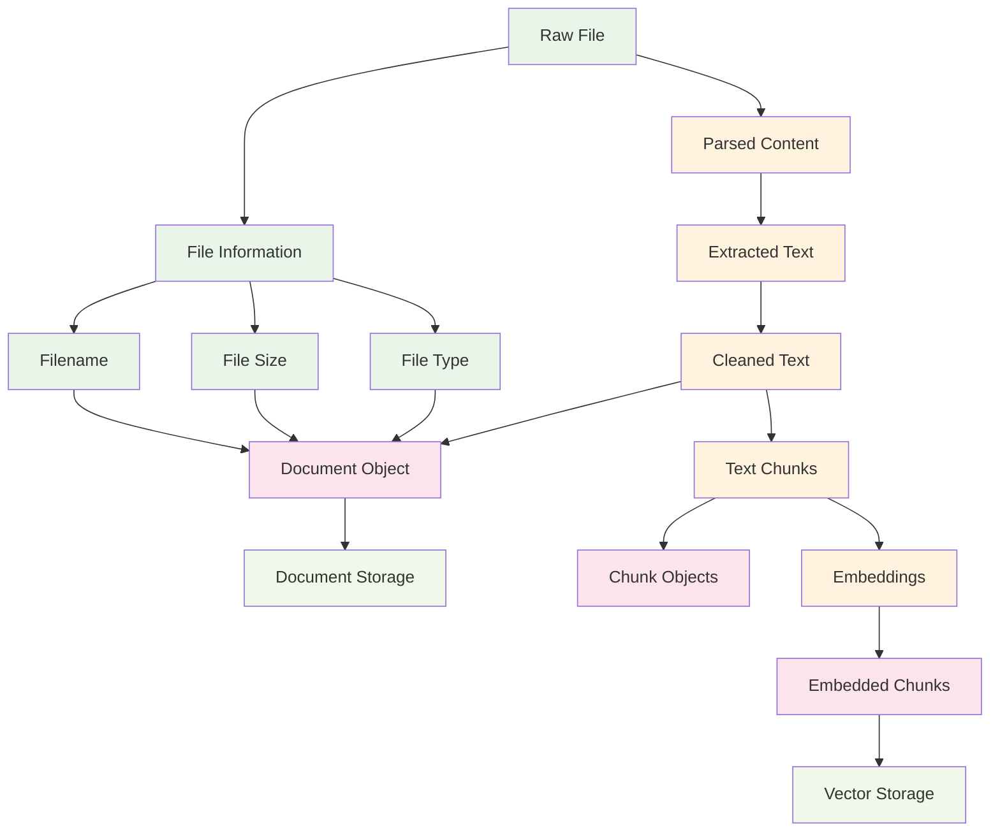
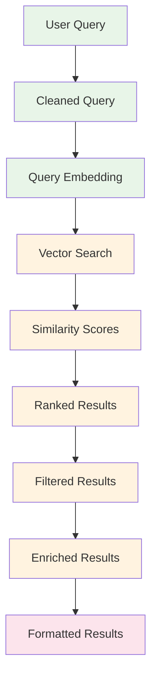

# Data Flow Analysis - Intelligent Content Organizer MCP Agent

## 🔄 System Data Flow Overview



## 📊 Detailed Data Flow Sequences

### **1. Document Ingestion Flow**



### **2. Search and Retrieval Flow**



### **3. Content Generation Flow**



## 🗂️ Data Structure Flow

### **Document Processing Data Flow**



### **Search Data Flow**



## 📈 Data Transformation Stages

### **Stage 1: Input Processing**
```
Raw File/Text → File Metadata → Document Object
```

**Data Transformations:**
- File size calculation
- File type detection
- Content extraction
- Metadata creation

### **Stage 2: Text Processing**
```
Raw Text → Cleaned Text → Preprocessed Text
```

**Data Transformations:**
- Character encoding normalization
- Whitespace normalization
- Special character handling
- Language detection

### **Stage 3: Chunking**
```
Preprocessed Text → Text Chunks → Chunk Objects
```

**Data Transformations:**
- Text segmentation
- Chunk metadata creation
- Position tracking
- Overlap management

### **Stage 4: Embedding**
```
Text Chunks → Vector Embeddings → Embedded Chunks
```

**Data Transformations:**
- Text to vector conversion
- Dimensionality reduction
- Normalization
- Metadata enrichment

### **Stage 5: Storage**
```
Document Object → Document Storage
Embedded Chunks → Vector Storage
```

**Data Transformations:**
- Serialization
- Index creation
- Metadata storage
- Cache population

## 🔄 Data Persistence Flow

### **Document Storage Flow**
```
Document Object → JSON Metadata + Text Content → File System
```

**Storage Structure:**
```
data/documents/
├── metadata/
│   ├── {doc_id}.json     # Document metadata
│   └── ...
└── content/
    ├── {doc_id}.txt      # Document content
    └── ...
```

### **Vector Storage Flow**
```
Embedded Chunks → FAISS Index + Metadata → Persistent Storage
```

**Storage Structure:**
```
data/vector_store/
├── content_index.index           # FAISS vector index
└── content_index_metadata.json   # Chunk metadata
```

## 🎯 Data Quality Assurance

### **Input Validation**
- File type validation
- File size limits
- Content encoding detection
- Malformed content handling

### **Processing Validation**
- Text extraction success
- Chunk quality assessment
- Embedding generation validation
- Storage operation verification

### **Output Validation**
- Search result relevance
- Response format consistency
- Error handling completeness
- Performance metrics collection

## 📊 Data Flow Metrics

### **Performance Indicators**
- **Processing Time**: Document ingestion duration
- **Throughput**: Documents processed per minute
- **Memory Usage**: Peak memory consumption
- **Storage Efficiency**: Compression ratios
- **Search Latency**: Query response time

### **Quality Metrics**
- **Text Extraction Rate**: Successful content extraction
- **Chunk Quality**: Average chunk coherence
- **Embedding Quality**: Similarity score distribution
- **Search Relevance**: User satisfaction scores

## 🔧 Data Flow Optimization

### **Current Optimizations**
1. **Batch Processing**: Multiple documents processed together
2. **Caching**: In-memory document and embedding cache
3. **Async Processing**: Non-blocking I/O operations
4. **Lazy Loading**: On-demand resource loading

### **Future Optimizations**
1. **Streaming Processing**: Real-time document processing
2. **Distributed Storage**: Multi-node storage architecture
3. **Compression**: Advanced data compression techniques
4. **Index Optimization**: Improved vector search algorithms

This data flow analysis provides a comprehensive view of how information moves through the intelligent content organizer system, from input to output, with detailed transformation stages and optimization opportunities. 